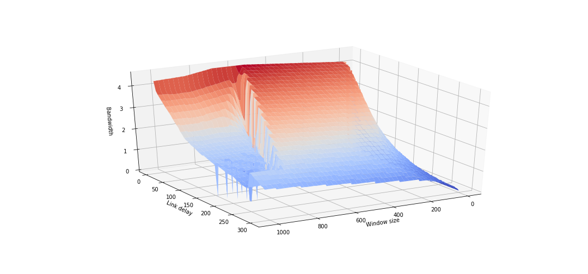
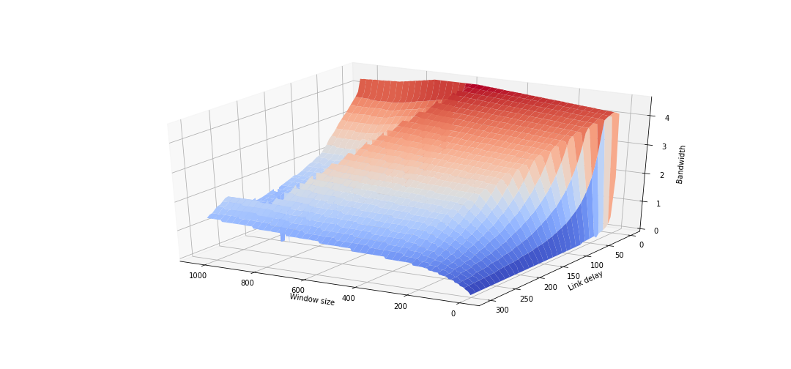

# NS3 DCE Laboratory using Vagrant Environment
The ojective of this laboratory is to launch NS3 network simulator with DCE support and to research dependency
between TCP window size and TCP transfer speed.

#### 1.  Setup Vagrant

Download from https://www.vagrantup.com/downloads.html and install

#### 2.  Clone current directory

We will suppose that it is cloned into ```<lab_dir>```

#### 3. Setup environment
```bash
cd <lab_dir>
vagrant up
```
This will create a VM with needed environment.
Shared folder ```<lab_dir>/share``` is also created and conntected to ```~/share``` in guest VM.
#### 4. Connect to VM and launch perfomance scrtipt
```bash
vagrant ssh
$./run-perf.sh
$exit
```

```run-perf.sh``` is a scrtipt based on **iperf** test that measure network perfomance.
Parameters changed as follows.

|Changed parametr     | Begin value | End value | Step |
|-------------------- |:-----------:|:---------:|:----:|
|TCP window size (Kb) | 1 			| 301 		| 5    |
|Link delay (ms) 	  | 1 			| 1026 		| 5    |

Resulted **bandwidth** data is saved in ```~/share/data.csv``` file.


#### 5. Destroy VM and visualise data

VM image can be destroyed via the command:
```bash 
vagrant destroy
```

After this done data can be represented as 3D plot.
JupyterNotebook scrtipt for this task is provided in 
```<lab_dir>/visualisation/BandwithVisualisation.ipynb```

#### 6. Make graphics and Interpret the results



The growth of link delay can be resisted with moderate increase of window size, as can be seen in graphics.
Nevertheless, a massive increase of window size is frequenlty followed by a drop in bandwidth regardless of link delay mostly.

**As a result, with increase of link delay the window size impact on the bandwidth goes up.**